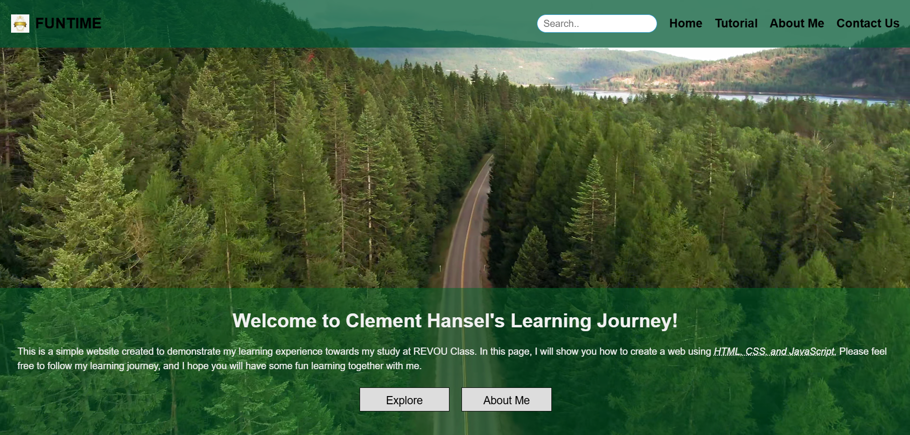
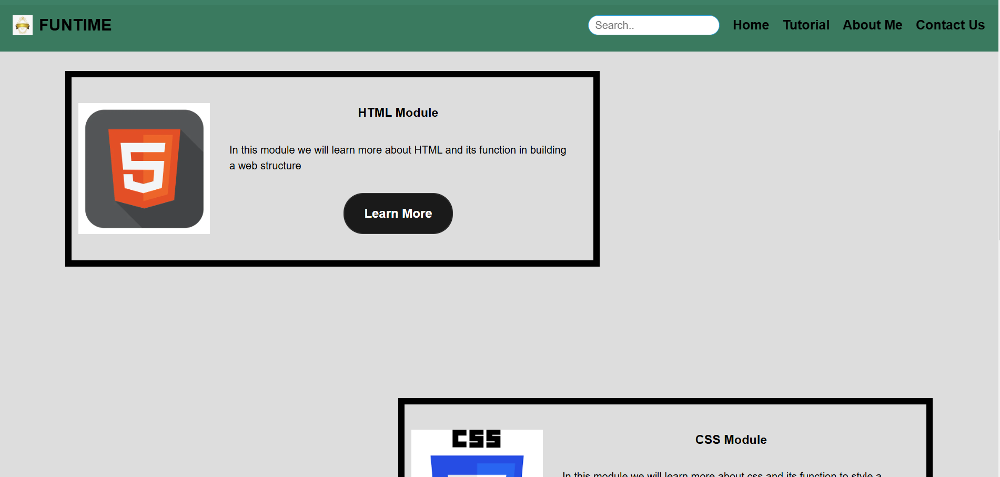
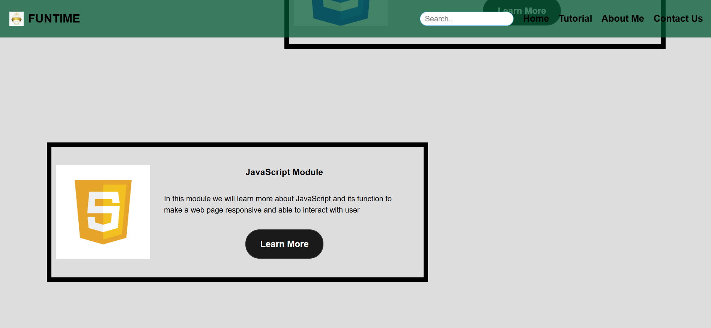
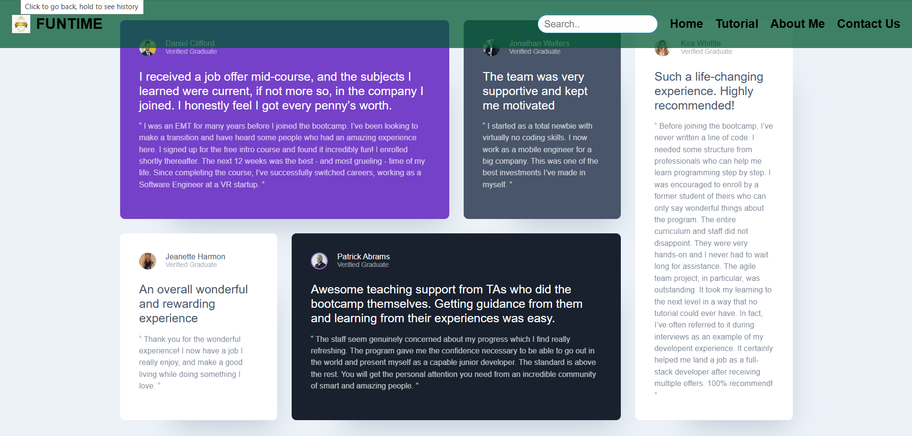
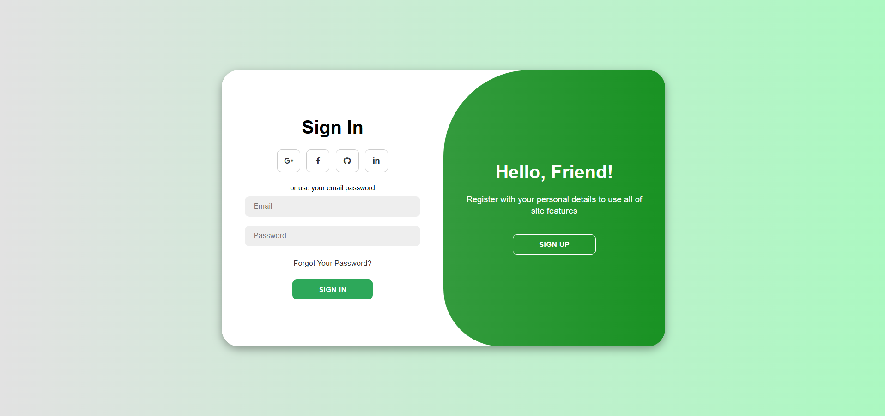
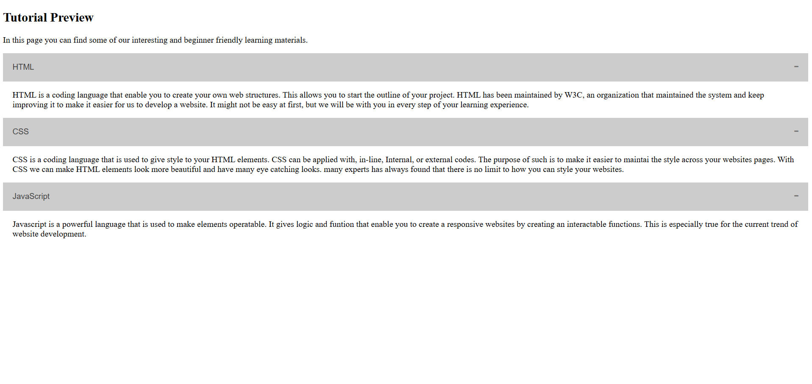
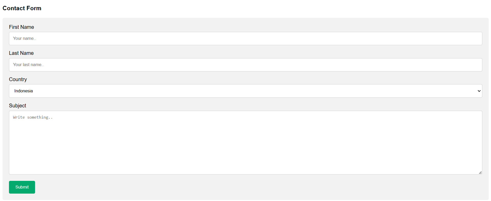

# CLEMENT HANSEL

[greedybugz@gmail.com](mailto:greedybugz@gmail.com)

---

### Website Link

Here is the link to the Website.
https://clementhansel.netlify.app

---

## Web Interface

Hi ! Welcome to my **Assignment 1** in RevoU Class. The purpose of this documentation is to provide me or others with information about the website that i made.

The website is intended to show my understanding of what I have learnt in Module 1. The website that I made consisted of :

1. Index.html
2. signup.html
3. Tutorial.html
4. Contactus.html
5. Readme.md

### Index.html

In this web page you will see the landing page, with sticky navbar, video running in loop in background, and a header that should be shown at the bottom of the first screen.

The idea is to have 1 full screen for the navbar, video background, and the bottom header. the page will show well in large screens as i still have problem with other device displays.

the next scroll should show the HTML, CSS, and JS section. each of this section should have the button linked to Tutorial.html using a javascript.
This is intended to show the difference of button usage between Javascript and html "a" tag.

The last section is the testimony section showing grid template with css. This section I made following the instruction from youtube, while the job is done, there are some function that I still dont understand. As I failed to replicate it well in the second section.

The functionality of the website is as follows :

1. Home navbar will redirect to index.html
2. Tutorial navbar will redirect to tutorial.html
3. Contact US navbar will redirect to contactus.html
4. Tutorial button will redirect to tutorial.html
5. Sign Up button will redirect to signup.html
6. HTML Tutorial link will redirect to external website link
7. CSS Tutorial link will redirect to external website link
8. Javasript Tutorial link will redirect to external website link

### signup.html

This web page will showcase the signup and signin page. It still not fully functional and all the buttons will not work as i havent linked it to the proper destination. but the main idea is to show my understanding of transition and form element.

### Tutorial.html

This web page will show some basic HTML elements and tag. The purpose of this page is to have all the content about HTML, CSS, and JS, also some more in-depth learning material. But i didnt manage to finish is because i was trying to fix some function and responsiveness of index.html

### Contactus.html

This web page will show the form element and some radio button for the purpose of previous assignment. Again, I will try to develop it better in the future.

### README.MD

I hope that this **information** may be useful to help us **connect** together, and may help us to finish future projects together as well as creating a great **supporting community** for better **learning environment**.

> ✨ Things are never quite as scary when you've got a best friends

This is a brief overview of my data, I hope this will help you to understand me a little bit more.

|   Data    |       Description        |
| :-------: | :----------------------: |
| Full Name |      Clement Hansel      |
|    Sex    |           Male           |
|    Age    |            33            |
|  Status   |          Single          |
|   Hobby   | Swimming and Adventuring |
|  E-mail   |  [greedybugz@gmail.com]  |
|   Phone   |      +628111546034       |

For those who are still afraid about things that you dont understand, please know, that I am also in that particular environment now. But lets be brave and walk it through step by steps and keep visioning our goals.

---

### [Assignment Requirement]

Here is the list of the requirements for this final assignment

[x] Building a web page and try to use correct semantics for each elements

[x] Applying responsive design with media query

[x] Centering elements using flex

[x] Creating sticky navbar

[x] Deploy in github and put link in the markdown

### [Advance Assignment Requirement]

[] Create hamburger in responsive navbar
[x] Create 1 grid layoud
[x] Add animation

Thankyou very much for reading this document, I hope you can find this usefull. If you have any question, please dont hesitate to contact me.

[FIN]
