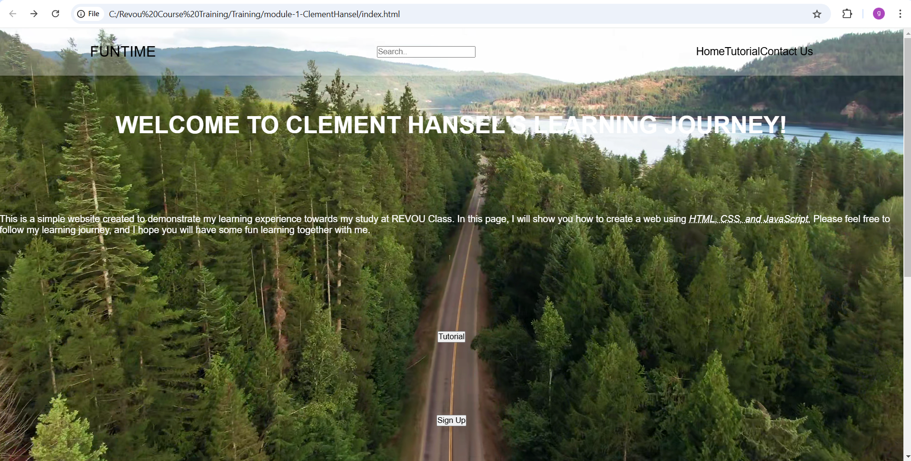
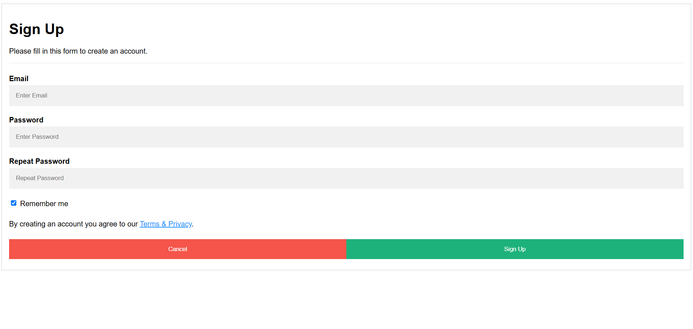

# CLEMENT HANSEL

[greedybugz@gmail.com](mailto:greedybugz@gmail.com)

---

## Web Interface

Hi ! Welcome to my **Assignment 1** in RevoU Class. The purpose of this documentation is to provide me or others with information about the website that i made.

The website is intended to show a video background in full view height. the information after that is suppose to be in a separate div or section. But due to my lack of skill and time, it was done in a crude manner, just enough to get the important thing across.

The functionality of the website is as follows :

1. Home navbar will redirect to index.html
2. Tutorial navbar will redirect to tutorial.html
3. Contact US navbar will redirect to contactus.html
4. Tutorial button will redirect to tutorial.html
5. Sign Up button will redirect to signup.html
6. HTML Tutorial link will redirect to external website link
7. CSS Tutorial link will redirect to external website link
8. Javasript Tutorial link will redirect to external website link

I hope that this **information** may be useful to help us **connect** together, and may help us to finish future projects together as well as creating a great **supporting community** for better **learning environment**.

> ✨ Things are never quite as scary when you've got a best friends

This is a brief overview of my data, I hope this will help you to understand me a little bit more.

|   Data    |       Description        |
| :-------: | :----------------------: |
| Full Name |      Clement Hansel      |
|    Sex    |           Male           |
|    Age    |            33            |
|  Status   |          Single          |
|   Hobby   | Swimming and Adventuring |
|  E-mail   |  [greedybugz@gmail.com]  |
|   Phone   |      +628111546034       |

For those who are still afraid about things that you dont understand, please know, that I am also in that particular environment now. But lets be brave and walk it through step by steps and keep visioning our goals.

---

## Home

### Signup

### Tutorial

### [Assignment Requirement]

[x] Page structure and semantics

[x] Add Content

[x] Form Set - Text Area - Input Type Text - Submit Button - Radio Button, Checkbox, and select button
[FIN]
